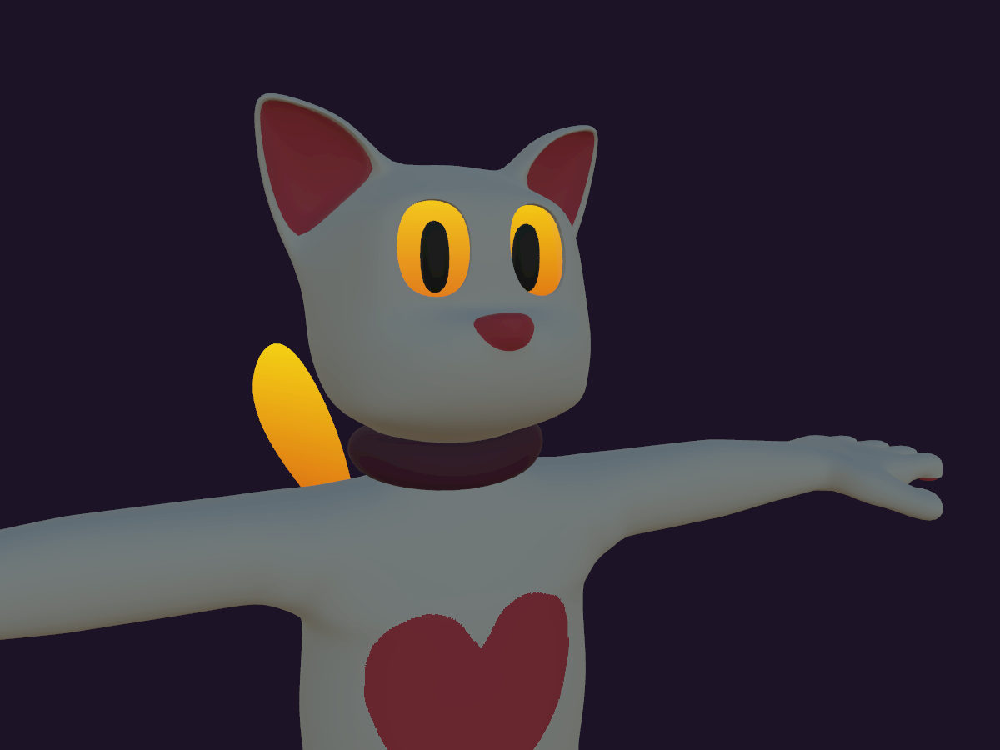

- # floaty

a vrchat avatar of [my fursona](https://hecko.my.to/fursonae#floaty) made in blender 3.5, currently quite wip

[uploaded version](https://vrchat.com/home/avatar/avtr_2edfaf3f-90ee-4b39-bf69-7e326042dbf5)

don't expect quality nor best practices, this is for myself first and foremost

cc0 except for the parts i don't own (default vrchat animations, extensions, etc)

## features

- idly flapping wings
- expressions controlled by left hand gestures
- a deliberate lack of mouth
- the quest version actually tries to not be Very Poor tier wow

## to fix

- eyebrows for closed eyes
- eyes closed gesture separate blend shape
- "glowing seam" on mobile
- flatten eyes to make them not poke into eyebrows
- thumb is probably wrong
- smoother head
- better expressions (mostly surprise needs to be bigger)

## to add

- arm movement for non-vr platforms (pointing, waving, arms crossed, dab)
- subtle ear/wing physbones (wing would have to go back to quads)
- export script
- tail?
- sparkles (detail texture)
- cross-legged sit
- flight (gogoloco style, visual-only)
- vrm version so it's not just vrchat
- toggleable clothes/accessories
